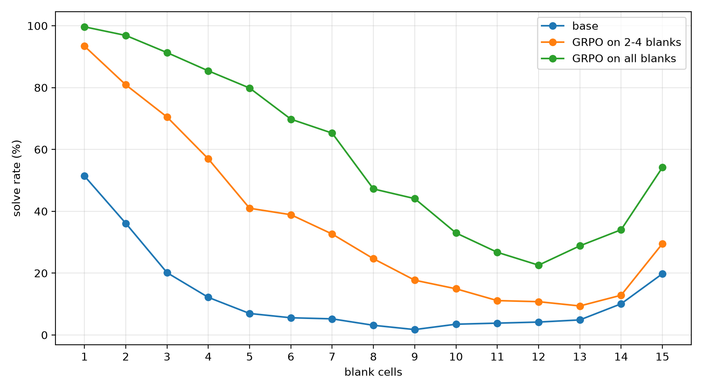

# sudoku-rlvr

Teaching Qwen 1.7B to solve 4x4 sudoku using RLVR and GRPO with reasoning disabled. 

Reward function is binary, either returning 1.0 for a correctly solved puzzle, 0.0 otherwise. Verifier checks for correct puzzle arrangmenet with rows, columns, and sections. 

Trained using a RTX3090 on Runpod. Full training run took \~77m. 

### Files
- `sudoku.py`: util functions for generation of puzzles with dynamic # of blanks, extraction from LLM output, and verification of attempts
- `model.py`: utl function for running base/trained models (used in evals)
- `train.py`: runnable script for training with GRPO and LoRA on specific config (reasoning disabled, 4 rollouts per prompt, batch size of 8, 4 batches before weight update)
- `eval.py`: runnable script that evaluates model on all puzzles with different amounts of blanks 
- `/adapters`: includes adapters for a training run which only used puzzles with 2-4 blanks during reward training, and another for all blanks (1-15)

### Results
Training on just puzzles with 2-4 blanks showed significant improvement and generalization across puzzles higher than 2-4 blanks in which it was not trained on (\~5m total training time). 
Training on all blanks showed higher overall improvement but solve rate still remained <50% for 8-14 blanks despite \~15x cost increase (\~77m total training time).

